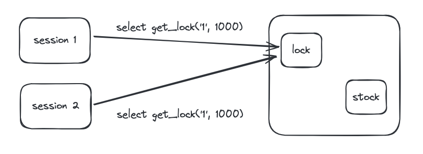

# Welcome to concurrency-stock-system 👋


> Concurrency Stock System

## Install

```sh
$ docker-compose up -d
```

## Problem & Solution 1

- Race condition (stock update)
- `synchronized`
  - `@Transactional` can also cause race condition. So must remove before using it.

## Problem & Solution 2

- Race condition
  - The `synchronized` keyword is guaranteed only within one process. 
  - If there is only one server, this is fine, but if there are multiple servers, access to the data occurs from multiple places.
- Pessimistic Lock
  - If collisions occur frequently, better performance than Optimistic Lock.
  - Guarantee data consistency.
  - Performance may decrease.
- Optimistic Lock
  - Use versioning technique. So requires version column.
  - Performance advantage by not holding a lock.
  - The hassle of having to write your own retry logic when an update fails.
  - Recommended when conflicts do not occur frequently.
- Named Lock
  - The lock is not automatically released when the transaction ends, so the lock is released only with a command or when the preemption time expires.
  - If the same data source is used, the connection pool may become insufficient, so it is actually recommended to use separate data sources.
  - Mainly used when implementing distributed lock.
  - Easy to implement timeout.
  - Guarantee data consistency.
  - In reality implementation maybe complicated.
  - 

## Author

👤 **Kevin Ahn**

* Github: [@seung-seop-ahn](https://github.com/seung-seop-ahn)